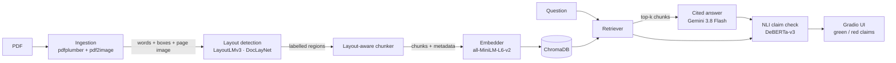

# Veridoc — Layout-Aware RAG for Medical Documents

Veridoc answers questions about medical PDFs and shows, claim by claim, which
parts of the answer are actually supported by the source document.

It explores two ideas on top of a standard Retrieval-Augmented Generation (RAG)
pipeline:

1. **Layout-aware chunking.** Instead of cutting documents into fixed-size
   pieces of text, Veridoc uses **LayoutLMv3** to detect the page's structure
   (titles, section headers, paragraphs, tables, lists, captions) and chunks
   along those boundaries. A table is never split in half, and every chunk
   carries its region type, so retrieval can be filtered, e.g. *"search only
   tables"*.
2. **NLI hallucination detection** *(planned)*. After the LLM answers, the
   answer is split into individual claims and each claim is checked against the
   retrieved evidence with a **DeBERTa NLI cross-encoder**. The UI marks
   grounded claims green and unsupported claims red.

> **Status: work in progress.** Indexing (PDF → layout → chunks → embeddings →
> vector store), retrieval and cited answer generation are implemented.
> Hallucination checking and the Gradio UI are still being built — see
> [Roadmap](#roadmap).

---

## How it works



| Stage | Module | What it does | Status |
|---|---|---|---|
| Ingestion | `src/ingestion.py` | Extracts every word with its bounding box, and renders each page as an image | ✅ |
| Layout detection | `src/layout.py` | Groups words into lines, labels each line with LayoutLMv3 (11 DocLayNet classes), merges lines into regions | ✅ |
| Chunking | `src/chunker.py` | One chunk per region; long regions are split with a 250-token sliding window with 50-token overlap | ✅ |
| Embedding | `src/embedder.py` | 384-dim, L2-normalized sentence embeddings | ✅ |
| Vector store | `src/vectorstore.py` | Persistent ChromaDB collection (cosine), metadata filtering, re-ingest without duplicates | ✅ |
| Retrieval | `src/retriever.py` | Top-k search with region/document filters, default noise exclusion and a relevance floor | ✅ |
| Generation | `src/generator.py` | Gemini 3.8 Flash via LlamaIndex; answers only from passages, cites `[n]` per sentence, abstains when nothing relevant was retrieved | ✅ |
| Hallucination check | `src/hallucination.py` | Claim splitting + NLI entailment scoring | ⏳ |
| Logging | `src/logger.py` | SQLite log of queries, answers and scores | ⏳ |
| UI | `app.py` | Gradio interface | ⏳ |

### Layout detection in more detail

LayoutLMv3 reads the page three ways at once: the **text**, the **position** of
each piece of text (boxes scaled to 0–1000), and the **page image**. Veridoc uses
[`Kwan0/layoutlmv3-base-finetune-DocLayNet-100k`](https://huggingface.co/Kwan0/layoutlmv3-base-finetune-DocLayNet-100k),
LayoutLMv3 fine-tuned on DocLayNet (reported F1 0.87). It predicts:

`caption · footnote · formula · list_item · page_footer · page_header · picture · section_header · table · text · title`

Implementation choices:

- **Line-level input.** The model was fine-tuned with line-level boxes, so words are grouped into lines first and each line is labelled as a unit.
- **No truncation.** Pages longer than 512 tokens are processed in overlapping windows (stride 128) rather than cut off.
- **Robust labels.** Each line's label is the average of its tokens' probabilities, using the tokenizer's `word_ids()` alignment. Lines below 50% confidence fall back to `text`.
- **Column-aware regions.** A line joins a region only if it has the same label and sits directly below it. Two text columns therefore stay separate, and table cells stay together.

---

## Getting started

### Prerequisites

- **Python 3.10+** (developed on 3.13)
- **Poppler**, which `pdf2image` uses to render PDF pages:
  - Windows: download from [poppler-windows](https://github.com/oschwartz10612/poppler-windows/releases) and add its `bin/` folder to `PATH` (TeX Live also ships a compatible `pdftoppm`)
  - macOS: `brew install poppler`
  - Ubuntu/Debian: `sudo apt install poppler-utils`
- About **1.5 GB of disk** for models, downloaded automatically on first run (LayoutLMv3 ≈ 500 MB, MiniLM ≈ 90 MB)

### Install

```bash
git clone <your-repo-url> veridoc
cd veridoc

python -m venv .venv
# Windows:      .venv\Scripts\activate
# macOS/Linux:  source .venv/bin/activate

# 1. PyTorch first. Pick ONE:
pip install torch --index-url https://download.pytorch.org/whl/cpu     # CPU only
pip install torch --index-url https://download.pytorch.org/whl/cu121   # NVIDIA GPU
#   (see https://pytorch.org/get-started/locally/ for other CUDA versions)

# 2. Everything else
pip install -r requirements.txt
```

### Gemini API key

Answer generation uses the Gemini API. Flash models are free of charge on the free tier.

1. Create a key at [Google AI Studio](https://aistudio.google.com/apikey).
2. Create a file called `.env` in the project root:
   ```
   GOOGLE_API_KEY=your-key-here
   ```
   `.env` is git-ignored, so the key never gets committed. Indexing and retrieval work without a key; only generation needs one.

> **Windows note.** If `import torch` fails with *"WinError 4551: An Application
> Control policy has blocked this file"*, Windows Smart App Control is blocking
> PyTorch's DLLs. Either use a PyTorch install your system already allows, for
> example by creating the venv with `python -m venv --system-site-packages .venv`,
> or review the setting under *Windows Security → App & browser control*.

### Run

The Gradio app (`python app.py`) is not built yet. For now, the indexing
pipeline can be driven from Python. Put a PDF in `data/samples/` and run:

```python
from pathlib import Path

from src.ingestion import load_pdf_pages
from src.layout import LayoutDetector
from src.chunker import chunk_regions, get_chunk_stats
from src.embedder import Embedder
from src.vectorstore import VectorStore
from src.retriever import Retriever
from src.generator import Generator

pdf = Path("data/samples/my_document.pdf")

# 1. Index the document
pages   = load_pdf_pages(pdf)
regions = LayoutDetector().detect_document(pages)
chunks  = chunk_regions(regions, doc_id=pdf.name)
print(get_chunk_stats(chunks))

embedder = Embedder()
store    = VectorStore()                      # persists to data/chroma_store/
store.add_chunks(chunks, embedder.embed_chunks(chunks))

# 2. Ask questions
retriever = Retriever(embedder, store)
for hit in retriever.retrieve("What is the recommended dose?"):
    print(f"{hit.score:.2f}  p{hit.page_num + 1}  [{hit.region_label}]  {hit.text[:80]}")

# Layout-aware filtering: search tables only
tables = retriever.retrieve("What is the recommended dose?", region_types=["table"])

# 3. Generate a cited answer (needs GOOGLE_API_KEY)
question = "What is the recommended dose?"
result = Generator().generate(question, retriever.retrieve(question))
print(result.answer)          # "Start with 500 mg once daily [1]. ..."
print(result.cited)           # passages used, e.g. [1, 2] → result.sources[0], [1]
print(result.abstained)       # True if the document doesn't contain the answer
```

By default the retriever skips running page headers/footers and fragments
under 5 tokens, and returns **nothing** when no chunk reaches a cosine
similarity of 0.25. An empty result means "not in the document". The
generator then answers "I could not find this information in the provided
document." without calling the LLM at all.

Run this from the project root so that `config` and `src` can be imported.

### Tests

```bash
pytest tests/
```

*(The test suite is planned for step 12 of the roadmap.)*

---

## Configuration

All tunable values live in [`config.py`](config.py). None are hard-coded in the modules.

| Setting | Default | Meaning |
|---|---|---|
| `LAYOUTLM_MODEL_NAME` | `Kwan0/layoutlmv3-base-finetune-DocLayNet-100k` | Layout model |
| `LAYOUTLM_CONFIDENCE_THRESHOLD` | `0.5` | Below this, a line is labelled `text` |
| `PDF_DPI` | `200` | Page rendering resolution |
| `MAX_CHUNK_TOKENS` / `CHUNK_OVERLAP_TOKENS` | `250` / `50` | Chunk size limit, sized to MiniLM's 256-token input |
| `EMBEDDING_MODEL_NAME` | `sentence-transformers/all-MiniLM-L6-v2` | Embedding model |
| `TOP_K_RETRIEVAL` | `5` | Chunks retrieved per question |
| `RETRIEVAL_MIN_SCORE` | `0.25` | Relevance floor (cosine similarity); calibrate on your documents |
| `RETRIEVAL_EXCLUDED_LABELS` | `page_header`, `page_footer` | Region types skipped unless explicitly requested |
| `LLM_MODEL_NAME` | `gemini-3.8-flash` | Answer model |
| `LLM_THINKING_LEVEL` | `low` | Gemini reasoning depth before answering |
| `LLM_MAX_OUTPUT_TOKENS` | `2048` | Output budget; includes thinking tokens |
| `CHROMA_DIR` | `data/chroma_store/` | Where the vector index is stored |

---

## Project structure

```
veridoc/
├── config.py            all constants, model names, paths
├── requirements.txt
├── src/
│   ├── ingestion.py     PDF → words + boxes + page images
│   ├── layout.py        LayoutLMv3 region detection
│   ├── chunker.py       layout-aware chunking (Novelty 1)
│   ├── embedder.py      sentence-transformer wrapper
│   ├── vectorstore.py   ChromaDB wrapper
│   ├── retriever.py     question → filtered, relevant chunks
│   ├── generator.py     cited answers from Gemini
│   ├── hallucination.py (planned, Novelty 2)
│   └── logger.py        (planned)
├── app.py               (planned) Gradio UI
├── tests/               (planned)
├── notebooks/           (planned) layout, chunking and NLI exploration
└── data/
    ├── samples/         your PDFs
    └── chroma_store/    created automatically
```

---

## Roadmap

- [x] Configuration
- [x] PDF ingestion
- [x] LayoutLMv3 region detection
- [x] Layout-aware chunking
- [x] Embeddings
- [x] Vector store
- [x] Retriever with region-type filtering
- [x] Answer generation (LlamaIndex + Gemini)
- [ ] NLI hallucination detection
- [ ] SQLite query logging
- [ ] Gradio UI
- [ ] Unit tests
- [ ] Notebooks: layout exploration, fixed-size vs layout-aware chunking, NLI evaluation

---

## Known limitations

- **Scanned PDFs** have no embedded text. They are detected and kept as empty placeholder pages; OCR is not implemented yet.
- **Reading order** comes from geometric rules (line grouping and column-aware region merging), not a full reading-order model. Unusual layouts can merge regions incorrectly.
- **Text inside figures** (axis labels, diagram annotations, math symbols) is sometimes labelled `text` and becomes tiny chunks. They stay in the index but are skipped at query time (minimum 5 tokens).
- **Short chunks lack context.** A one-line region such as "Figure 3 gives an overview…" is retrieved without the section heading above it. Prepending the nearest section header to each chunk is a planned improvement.
- **Keyword-style queries score low.** The embedding model is tuned for sentence-like questions: "figure" scores about 0.2 against a caption that the question "Which figures show examples…?" matches at 0.9.

## Licenses

The LayoutLMv3 weights (and fine-tunes derived from them) are released under
**CC BY-NC-SA 4.0**, which means **non-commercial use only**. This project is
intended for research and education.
