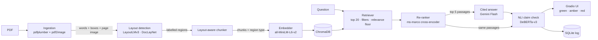

# Veridoc — Layout-Aware RAG for Medical Documents

Veridoc answers questions about medical PDFs and shows, **sentence by sentence**, which parts of the
answer the source document actually supports.

It adds two ideas to a standard Retrieval-Augmented Generation (RAG) pipeline:

1. **Layout-aware chunking.** Instead of cutting a document every *N* tokens, Veridoc detects the page
   structure with **LayoutLMv3** (paragraphs, tables, lists, headings, captions) and chunks along those
   boundaries. A table is never cut in half, and every chunk knows its region type, so a question can be
   restricted to, say, *tables only*.
2. **NLI hallucination detection.** After the LLM answers, every sentence is checked against the
   retrieved evidence by a **DeBERTa NLI cross-encoder** and coloured in the UI: **green** (supported),
   **amber** (not found in the document) or **red** (contradicted by it). Hovering a sentence shows the
   passage it was checked against.

Both ideas are measured, not just implemented — including where they don't help.

---

## Results at a glance

Measured on the included 26-page FDA drug label with hand-labelled question and claim sets
(one annotator, small sets — see [Evaluation](#evaluation) for method and caveats).

| What | Result |
|---|---|
| **Structure** — layout-aware vs. fixed-size chunks | 0% of chunks cut mid-word (fixed-size: 20%); 7% of tables split (fixed-size: 43%) |
| **Retrieval** — right passage in the top 5 (18 questions) | **0.94** with layout-aware chunks + re-ranking, vs. 0.78 for fixed-size chunks — using 40% of the context |
| **Re-ranking** — MRR on the same questions | 0.47 → **0.79** (+31 ms per question) |
| **Hallucination check** — 36 labelled claims | flags **23 of 24** hallucinations; keeps **10 of 12** true facts green |
| **Tests** | 101 (80 fast unit tests + 21 behaviour tests on the real models) |

The honest part: with a plain bi-encoder and no re-ranking, fixed-size chunks retrieve *better* than
layout-aware ones (MRR 0.71 vs. 0.47). Layout-aware chunking wins on structure always, and on retrieval
once a re-ranker is added. Details in [notebook 02](notebooks/02_chunking_comparison.ipynb).

---

## How it works



| Stage | Module | What it does |
|---|---|---|
| Ingestion | `src/ingestion.py` | Extracts every word with its bounding box and renders each page as an image |
| Layout detection | `src/layout.py` | Groups words into lines, labels each line with LayoutLMv3 (11 DocLayNet classes), merges lines into regions |
| Chunking | `src/chunker.py` | One chunk per region; long regions split with a 250-token sliding window, 50-token overlap, never mid-word |
| Embedding | `src/embedder.py` | 384-dim, L2-normalized sentence embeddings |
| Vector store | `src/vectorstore.py` | Persistent ChromaDB collection (cosine), metadata filtering, re-indexing without duplicates |
| Retrieval | `src/retriever.py` | Top-20 search with region/document filters, default noise exclusion, and a relevance floor |
| Re-ranking | `src/reranker.py` | Re-orders the candidates with a cross-encoder that reads question and passage together |
| Generation | `src/generator.py` | Gemini via LlamaIndex; answers only from the passages, cites `[n]` per sentence, abstains when nothing relevant was retrieved |
| Hallucination check | `src/hallucination.py` | Splits the answer into claims and scores each against every sentence (or table row) of every passage |
| Logging | `src/logger.py` | SQLite log of each question, the passages shown, the answer and every claim's verdict; built-in analytics |
| UI | `app.py` | Gradio app: index PDFs, ask with an optional region-type filter, colour-coded answer, analytics |

### Layout detection

LayoutLMv3 reads a page three ways at once: the **text**, the **position** of each piece of text
(boxes scaled to 0–1000), and the **page image**. Veridoc uses
[`Kwan0/layoutlmv3-base-finetune-DocLayNet-100k`](https://huggingface.co/Kwan0/layoutlmv3-base-finetune-DocLayNet-100k),
LayoutLMv3 fine-tuned on DocLayNet (reported F1 0.87), which predicts
`caption · footnote · formula · list_item · page_footer · page_header · picture · section_header · table · text · title`.

- **Line-level input.** The model was fine-tuned on line-level boxes, so words are grouped into lines and each line is labelled as a unit.
- **No truncation.** Pages longer than 512 tokens are processed in overlapping windows (stride 128).
- **Robust labels.** A line's label averages its tokens' probabilities via the tokenizer's `word_ids()` alignment; below 50% confidence it falls back to `text`.
- **Column-aware regions.** A line joins a region only with the same label and directly below it, so two text columns stay separate while table cells stay together.

### Retrieval in two stages

1. **Bi-encoder search.** The question is embedded and the 20 nearest chunks are fetched, excluding
   running page headers/footers and fragments under 5 tokens. Anything below a cosine similarity of
   **0.25** is dropped. If nothing survives, the generator answers *"I could not find this information
   in the provided document"* **without calling the LLM** — an off-topic question can't produce a
   confident, made-up answer.
2. **Cross-encoder re-ranking.** The survivors are re-ordered by `ms-marco-MiniLM-L-6-v2`, which reads
   the question and each passage *together*, and the best 5 go to the LLM. This matters on single-topic
   documents: every chunk of a drug label mentions the drug, so bi-encoder scores bunch together and a
   short chunk that is mostly the drug's name can outrank the real answer.

The relevance floor stays on the cosine score, whose range was measured (relevant ≥ 0.57, off-topic
≤ 0.13); the re-ranker's scores are uncalibrated and only used for ordering.

### Hallucination check

The answer is split into sentences (decimal- and abbreviation-safe), and each sentence is scored by an
NLI cross-encoder against **every sentence and table row** of every retrieved passage, plus each whole
passage. Scoring against single sentences matters: NLI models are trained on one-sentence premises, and
a claim copied almost verbatim from a passage scored 0.984 against its sentence but **0.001** against the
full passage. The verdict rule:

- entailment ≥ 0.5 against any premise → **grounded** (green)
- otherwise, contradiction ≥ 0.5 → **contradicted** (red, with the contradicting passage shown)
- otherwise → **unsupported** (amber — the fact isn't in the document, the typical hallucination)

Each claim also records whether the LLM's own `[n]` citation pointed at a supporting passage, so a correct
fact with a wrong citation is distinguished from an invented one.

---

## Getting started

### Prerequisites

- **Python 3.10+** (developed on 3.12 / Ubuntu and 3.13 / Windows)
- **Poppler**, used by `pdf2image` to render pages:
  - Ubuntu/Debian: `sudo apt install poppler-utils`
  - macOS: `brew install poppler`
  - Windows: [poppler-windows](https://github.com/oschwartz10612/poppler-windows/releases), with its `bin/` folder on `PATH`
- About **1.7 GB of disk** for the four models, downloaded automatically on first use
- Optional: an NVIDIA GPU. Everything runs on CPU; the GPU mainly speeds up indexing.

### Install

```bash
git clone <your-repo-url> veridoc
cd veridoc
python -m venv .venv
source .venv/bin/activate            # Windows: .venv\Scripts\activate

# 1. PyTorch first — pick ONE
pip install torch                                                     # Linux, CPU or NVIDIA GPU
pip install torch --index-url https://download.pytorch.org/whl/cpu    # CPU-only, smaller download
#    Windows GPU builds: see https://pytorch.org/get-started/locally/

# 2. Everything else
pip install -r requirements.txt
```

On Linux the default PyTorch wheel already contains the CUDA runtime, so the only system requirement
for a GPU is an NVIDIA driver — no CUDA Toolkit. Check with
`python -c "import torch; print(torch.cuda.is_available())"`.

### Gemini API key

Answer generation uses the Gemini API, which has a free tier.

1. Create a key at [Google AI Studio](https://aistudio.google.com/apikey).
2. Put it in a file called `.env` in the project root (git-ignored):
   ```
   GOOGLE_API_KEY=your-key-here
   ```

Without a key, indexing and retrieval still work; the app shows the retrieved passages and says that
generation is off.

### Run

```bash
python app.py        # then open http://127.0.0.1:7860
```

- **Index documents** — upload PDFs. The first upload loads the layout model (once). Re-uploading a file
  with the same name replaces it. A 26-page PDF indexes in about 10–15 s on a laptop GPU.
- **Ask** — type a question; optionally tick region types (e.g. only `table`) to restrict the search.
- **Analytics** — groundedness across all questions so far, the least-grounded answers, and which region
  types actually supplied evidence.

A public-domain sample is included: `data/samples/metformin_er_fda_label.pdf` — US FDA prescribing
information for metformin extended-release tablets from [DailyMed](https://dailymed.nlm.nih.gov/)
(26 pages, dosing tables, a boxed warning). Try *"What is the maximum daily dose?"*, *"What are the risk
factors for lactic acidosis?"*, or an off-topic question to see the abstention.

The server listens on `127.0.0.1` only. Set `GRADIO_SHARE = True` in `config.py` for a temporary public link.

### Using it from Python

The whole pipeline, as the app runs it:

```python
from pathlib import Path
from app import Veridoc

app = Veridoc()                                     # loads the models once
app.index_pdf(Path("data/samples/metformin_er_fda_label.pdf"))

turn = app.ask("What is the maximum daily dose?", region_types=None)
print([h.text[:60] for h in turn.hits])             # passages retrieved (works without a key)
if turn.report:                                     # None when there is no Gemini key
    print(turn.answer.answer)
    for claim in turn.report.claims:
        print(f"{claim.status:12} {claim.entailment:.2f}  {claim.text}")
```

Or compose the building blocks yourself:

```python
from src.embedder import Embedder
from src.vectorstore import VectorStore
from src.reranker import Reranker
from src.retriever import Retriever
from src.generator import Generator
from src.hallucination import HallucinationChecker

retriever = Retriever(Embedder(), VectorStore(), reranker=Reranker())
hits = retriever.retrieve("What doses are available?", region_types=["table"])   # tables only

answer = Generator().generate("What doses are available?", hits)                 # needs GOOGLE_API_KEY
report = HallucinationChecker().verify(answer)
print(report.groundedness, [c.text for c in report.flagged])
```

Run from the project root so that `config` and `src` are importable.

---

## Tests

```bash
pytest                    # all 101 tests, ~20 s (loads MiniLM, the re-ranker and DeBERTa once)
pytest -m "not model"     # 80 fast tests with fakes instead of models, ~13 s
```

| File | Covers |
|---|---|
| `test_chunker.py` | Chunking invariants: one region per chunk, token limit, word-boundary splits, overlap, nothing lost, original casing kept |
| `test_retriever.py` | Filters, relevance floor, re-ranking order; real MiniLM + ChromaDB behaviour (table-only search, off-topic → nothing, a drug-name decoy) |
| `test_hallucination.py` | Sentence splitting, premises, verdict rules, NLI label order; a labelled claim set on the real DeBERTa model |
| `test_logger.py` | Analytics against hand-computed values, atomic writes, cascading deletes, SQL injection, 8-thread concurrency |
| `test_app.py` | One colour per sentence, XSS escaping of model output, graceful degradation (no API key, failed log write) |

Tests that load a real model are marked `model` automatically (`tests/conftest.py`) and assert on
verdicts and invariants, never exact floats. The regression tests are known to work: re-introducing each
of the three silent bugs described [below](#design-notes) makes 12, 4 and 3 tests fail.

---

## Evaluation

Three notebooks, saved with their outputs so they read on GitHub without running anything.

| Notebook | Question | Headline result |
|---|---|---|
| [`01_layout_exploration`](notebooks/01_layout_exploration.ipynb) | What does LayoutLMv3 see? | Tables detected as whole regions; `section_header` is the label the model is least sure of, and 68 of 98 headings are bare chunks of ≤ 8 tokens |
| [`02_chunking_comparison`](notebooks/02_chunking_comparison.ipynb) | Layout-aware vs. fixed-size chunking | Wins on structure; loses on bi-encoder-only retrieval (MRR 0.47 vs 0.71); wins every metric with re-ranking, using 40% of the context |
| [`03_hallucination_eval`](notebooks/03_hallucination_eval.ipynb) | How good is the NLI check? | 23/24 hallucinations flagged, 10/12 true facts kept green; unreliable at telling *unsupported* from *contradicted*; the threshold barely matters because scores are bimodal |

**Method.** `data/eval/metformin_questions.json` holds 18 user-phrased questions, each with the phrases a
correct passage must contain (checked to exist in the index before scoring).
`data/eval/metformin_claims.json` holds 36 claims — for 12 questions, a faithful paraphrase, a
contradiction and a plausible invention — checked against the passages the app itself retrieves, so each
error can be attributed to retrieval or to NLI. Retrieval is compared at equal context budget as well as
hit@k, because larger chunks hand the LLM more text per hit.

**Caveats.** One document, one annotator, small sets: a difference of one question or claim is roughly
±3–6 points. Two gold phrases were widened once after inspecting results, because they missed a correct
wording; all variants were re-scored with the same set (noted in the JSON).

---

## Design notes

Things that went wrong while building this, and what they changed. Each has a regression test.

- **A bug that doesn't crash.** NLI models disagree on label order: `roberta-large-mnli` is
  `[contradiction, neutral, entailment]`, the `nli-deberta-v3` cross-encoders are
  `[contradiction, entailment, neutral]`. A hardcoded index reads *neutral* as *entailment* — every
  hallucination turns green and nothing errors. The checker reads the order from the checkpoint's own
  `id2label` instead.
- **Whole passages are the wrong premise.** A near-verbatim claim scored 0.001 against a two-sentence
  passage and 0.984 against the sentence it came from, so premises became single sentences (the idea
  behind SummaC). Notebook 03 shows the cost too: more premises mean more spurious "contradictions".
- **A regex that matched "meal."** The guard that stops sentence splitting after "et al." had no word
  boundary, so it also fired on "meal.", "renal." and "clinical.", silently merging sentences.
- **Measure before fixing.** A retrieval failure was first blamed on headings being chunked apart from
  their content. The data showed a different cause (the drug name dominating every embedding). The
  proposed fix — prefixing chunks with their heading — was measured and **not shipped** (MRR +0.07 alone,
  nothing on top of re-ranking); re-ranking was.
- **Layout-aware chunking is not a free win.** Its small chunks rank worse than fixed-size chunks with a
  bi-encoder alone. The shipped combination is chunking *plus* re-ranking, because that is what the
  measurements support.

---

## Configuration

All tunable values live in [`config.py`](config.py); none are hard-coded in the modules.

| Setting | Default | Meaning |
|---|---|---|
| `LAYOUTLM_MODEL_NAME` | `Kwan0/layoutlmv3-base-finetune-DocLayNet-100k` | Layout model |
| `LAYOUTLM_CONFIDENCE_THRESHOLD` | `0.5` | Below this, a line is labelled `text` |
| `PDF_DPI` | `200` | Page rendering resolution |
| `MAX_CHUNK_TOKENS` / `CHUNK_OVERLAP_TOKENS` | `250` / `50` | Chunk size limit (sized to MiniLM's 256-token input) and overlap |
| `EMBEDDING_MODEL_NAME` | `sentence-transformers/all-MiniLM-L6-v2` | Embedding model |
| `TOP_K_RETRIEVAL` | `5` | Passages given to the LLM |
| `RERANK_CANDIDATES` | `20` | Bi-encoder candidates re-ranked before the top 5 are kept |
| `RERANKER_MODEL_NAME` | `cross-encoder/ms-marco-MiniLM-L-6-v2` | Re-ranking model |
| `RETRIEVAL_MIN_SCORE` | `0.25` | Relevance floor (cosine similarity); calibrate on your documents |
| `RETRIEVAL_EXCLUDED_LABELS` | `page_header`, `page_footer` | Region types skipped unless explicitly requested |
| `LLM_MODEL_NAME` | `gemini-3.8-flash` | Answer model |
| `LLM_THINKING_LEVEL` / `LLM_MAX_OUTPUT_TOKENS` | `low` / `2048` | Gemini reasoning depth; output budget (includes thinking) |
| `NLI_MODEL_NAME` | `cross-encoder/nli-deberta-v3-small` | Claim verification model |
| `NLI_ENTAILMENT_THRESHOLD` | `0.5` | Entailment probability for a claim to count as grounded |
| `CHROMA_DIR` / `SQLITE_DB_PATH` | `data/chroma_store/` / `data/query_log.db` | Vector index and query log (both git-ignored) |
| `GRADIO_PORT` / `GRADIO_SHARE` | `7860` / `False` | UI port; `True` creates a temporary public link |

---

## Project structure

```
veridoc/
├── app.py               Gradio UI — the entry point
├── config.py            every constant, model name and path
├── requirements.txt
├── pytest.ini
├── src/
│   ├── ingestion.py     PDF → words + boxes + page images
│   ├── layout.py        LayoutLMv3 region detection
│   ├── chunker.py       layout-aware chunking
│   ├── embedder.py      sentence-transformer wrapper
│   ├── vectorstore.py   ChromaDB wrapper
│   ├── retriever.py     question → filtered, relevant passages
│   ├── reranker.py      cross-encoder re-ranking
│   ├── generator.py     cited answers from Gemini
│   ├── hallucination.py NLI claim verification
│   └── logger.py        SQLite query log + analytics
├── tests/               unit tests (fakes) + behaviour tests (real models)
├── notebooks/           layout exploration, chunking comparison, NLI evaluation
└── data/
    ├── samples/         PDFs (a public-domain FDA label is included)
    ├── eval/            labelled questions and claims
    └── chroma_store/    created automatically
```

---

## Query log and privacy

Every question is logged to `data/query_log.db` (SQLite, git-ignored) in three tables: `queries`,
`retrieved_chunks` (the passages the LLM saw, including their text) and `claims` (each sentence's verdict
and evidence). The Analytics tab reads it, or use it directly:

```python
from src.logger import QueryLogger
log = QueryLogger()
log.summary()         # mean groundedness, abstention rate, claims by status
log.worst_answers()   # least-grounded answers: the hallucination hotspots
log.region_stats()    # per region type: retrieved, cited, grounded claims supplied
```

Questions about medical documents can contain personal health data. The log never leaves your machine;
delete `data/query_log.db*` to clear it. Deleting a row from `queries` also removes its passages and claims.

---

## Known limitations

**Documents and layout**
- **Scanned PDFs** have no text layer. Scanned pages contribute no text, and a fully scanned PDF is
  rejected with a clear error. OCR is not implemented.
- **Reading order** comes from geometric rules, not a reading-order model; unusual layouts can merge
  regions incorrectly (e.g. a heading merged with the paragraph below it).
- **Headings are chunked apart from their content.** A heading such as *"The most common side effects …
  include:"* can be retrieved without the list beneath it. This is the one evaluation question that
  re-ranking doesn't fix.

**Retrieval**
- **Keyword-style queries score low.** The embedding model is tuned for sentence-like questions.
- **The relevance floor (0.25) was calibrated on one kind of document.** Check it against your own.

**Hallucination check**
- **Unsupported vs. contradicted is unreliable.** Half of invented claims are labelled *contradicted*:
  NLI reads any differing number or topic as refutation. Both are flags, and red claims show the passage
  behind the verdict.
- **Conflicting evidence resolves to green.** If one passage supports a claim and another refutes it,
  support wins. The only missed hallucination in the evaluation was such a case.
- **Negated paraphrases** ("should not exceed 2,000 mg" vs. "up to a maximum of 2,000 mg") can be missed.
- **Table rows are scored without their column header**, and flattened tables are further from NLI's
  training data than prose.
- **Claim splitting is rule-based:** a sentence starting in lowercase, or ending in an abbreviation not on
  the list, is not split, so two facts share one verdict.

**Possible next steps** (each would need a held-out evaluation set first): take entailment from single
sentences but contradiction from whole passages (+3 / −1 labels on the current set); a *conflict* state
when support and refutation are both high; attach headings to the list or paragraph they introduce;
prefix table rows with their header row; OCR for scanned pages.

---

## Troubleshooting

- **Windows: `WinError 4551: An Application Control policy has blocked this file`** when importing torch —
  Windows Smart App Control is blocking PyTorch's DLLs. Use a PyTorch install your system already allows
  (e.g. `python -m venv --system-site-packages .venv`) or review *Windows Security → App & browser control*.
- **Dual-boot, project on a shared NTFS partition** — create one virtual environment per OS; a venv holds
  OS-specific binaries and cannot be shared. On Linux keep it on the Linux partition
  (`python3 -m venv ~/.venvs/veridoc`): pip crashed twice while installing onto an `ntfs3` mount.
- **ROS 2 sourced in your shell** — ROS exports a `PYTHONPATH` that exposes its pytest plugins to every
  Python, and they crash on import. `pytest.ini` blocks them by name; no action needed.
- **`import torch` works but the GPU isn't used** — the NVIDIA driver must support the CUDA version bundled
  in the PyTorch wheel; `nvidia-smi` shows the highest version your driver supports.

---

## Licenses and data

- **LayoutLMv3** base weights are **CC BY-NC-SA 4.0** — *non-commercial use only*. The DocLayNet
  fine-tune used here declares no license of its own; treat it as inheriting that restriction.
- **all-MiniLM-L6-v2**, **ms-marco-MiniLM-L-6-v2** and **nli-deberta-v3-small** are Apache 2.0.
- **The sample PDF** is US FDA prescribing information from DailyMed, a US government work in the public
  domain. It is a test document, not medical advice.
- Generated answers come from the Gemini API and are subject to Google's terms.

Veridoc is a research and education project. It is not a medical device and must not be used for
clinical decisions.
